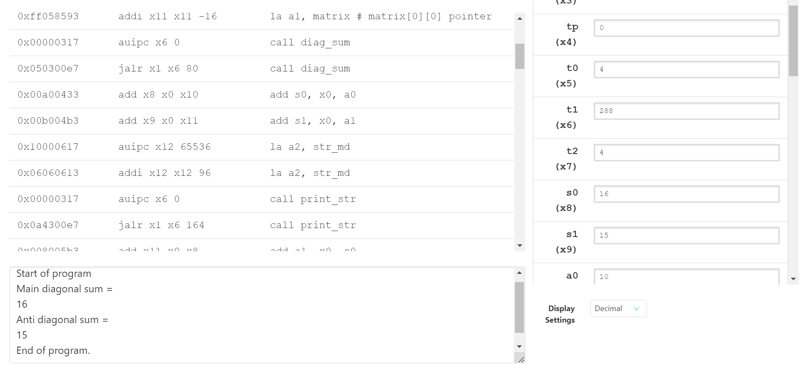

# Лабораторная работа 1

## Постановка задачи
Получить общее представление о системе команд RISC-V путём решения несложной прикладной задачи.
**Условие задачи:** _Найти сумму диагоналей массива. (N = 4, M = 4)_

## Последовательнось действий при выполнении лабораторной

* Был разработан алгоритм решения задачи
* Разработанный алгоритм был реализован на языке С (_Task1_DiagSum.c_) и языке ассемблера RISC-V ISA (_Task1_DiagSum.asm_)
* Код написанный на языке C был скомпилирован используя специальный RISC-V компилятор, был получен дамп (_Task1_DiagSum.dump_)
* Код написанный на языке ассемблера был скомпилирован проверен в онлайн-симуляторе Venus

## Результат выполнения
Зададим матрицу следующим образом
~~~
matrix:
.word 1, 0, 0, 8
.word 0, 3, 4, 0
.word 0, 2, 5, 0
.word 1, 0, 0, 7
~~~
Сумма таким образом по главной диагонали равна 16, по антидиагонали равна 15

Проверим правильность работы кода в симуляторе:

Значения выведены в лог с помощью системного вызова _ecall_ и сохранены в регистрах _s0_ и _s1_, значения получены верно
